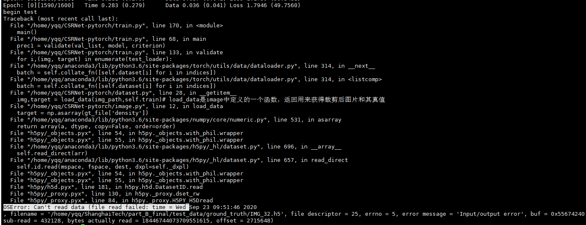

##  数据集

### 生成真值

get_gt.py

真值生成：D:\GitHub\projects\get_ground_truth

### 数据增强

image.py: 对图像进行裁剪（有4个不重叠的1/4尺寸的块，还有5个随机裁剪的1/4尺寸的块），然后得到裁剪之后块对应的真值。

### 加载数据集

dataset.py:

1. __ len __：返回样本数量

2. __ getitem __：返回一条数据/一个样本。

   参照pytorch书136.

   ```python
   import os 
   from PIL import Image
   import numpy as np
   class DogCat(data.Dataset):
       def __init__(self,root):
           imgs = os.listdir(root)
           self.imgs = [os.path.join(root,img) for img in imgs]
        def __getitem__(self,index):##图片的索引
           img_path = self.imgs[index]
           label =1 if 'dog' in img_path.split('/')[-1] else 0
           pil_img = Image.open(img_path)
           array = np.asarray(pil_img)
           data = t.from_numpy(array)
           return data,label
       def __len__(self):
           return len(self.imgs)
       
       
   ###实例化
   dataset = DogCat('./data/dogcat/') ###其实这里就是已经把对应路径下图片的路径全部得到，把图片和标签存为个类似元组的东西作为列表的一个元素
   img,label = dataset[0] ##相当于调用dataset.__getitem__(0)
   for img,label in dataset:
       print(img.size,img.float().mean(),label)
   ```

   

## 构建CSRNet

定义类CSRNet，显示对前端和后端进行定义（用make_layer函数实现），然后定义前向传播函数，最后定义初始化部分。

make_layer实现：一般都是用来实现网络地某个模块，包含很多层。都是先建立一个列表叫做layers = []，然后将各种将各种卷积层、池化层加入列表，最后采用nn.Sequential(*layers)将其中所有层拼接为一个模块。（ * layers，*加在实参上是将输入迭代器拆成一个个的元素）

初始化：这里是直接使用预训练了的VGG-16模型和参数。在初始化函数__ init __中，先调用 _initialize_weights()函数对所有层的参数进行初始化；然后使用VGG16预训练好的参数对其中的VGG16的层(前端网络)初始化。

## train.py

1. argparse库

   ```python
   import argparse
   parser = argparse.ArgumentParser(description='PyTorch CSRNet')#description描述这个参数解释器是做什么，在命令行显示帮助信息的时候会看到
   parser.add_argument('train_json', metavar='TRAIN',help='path to train json') #metavar是参数的名字，help是用来说明作用
   parser.add_argument('test_json', metavar='TEST',help='path to test json')
   parser.add_argument('--pre', '-p', metavar='PRETRAINED', default=None,type=str,help='path to the pretrained model')
   parser.add_argument('gpu',metavar='GPU', type=str,help='GPU id to use.')
   parser.add_argument('task',metavar='TASK', type=str,help='task id to use.')
   
   args = parser.parse_args() #将变量以标签-值的字典形式存入args字典中 
   ```

   argparse是python自带的命令行参数解析包，方便读取命令行参数。通过对象的add_argument函数来增加参数。参数前面不加--表示必须手动指定值的参数，且不能使用默认值；加了之后可以使用默认值。（所以不加的参数在运行程序的时候要指定，比如是:python train.py TRAIN=part_A_train.json）

2. 生成.json文件 

   ````python 
   nvinv# -*- coding: utf-8 -*-
   """
   Created on Sat Sep 19 15:52:02 2020
   
   @author: young
   """
   import os
   import glob
   import json
   root = '/home/yqq/ShanghaiTech'
   part_A_train = os.path.join(root,'part_A_final/train_data','images')
   part_A_test = os.path.join(root,'part_A_final/test_data','images')
   part_B_train = os.path.join(root,'part_B_final/train_data','images')
   part_B_test = os.path.join(root,'part_B_final/test_data','images')
   path_sets = [part_A_test]
   
   # 渚濇璇诲彇鏁版嵁闆嗕腑鐨勬瘡涓€寮犲浘鐗囷紝灏嗗叾鏀捐繘鍒楄〃img_paths
   img_paths = []
   for path in path_sets:
       for img_path in glob.glob(os.path.join(path, '*.jpg')):
           img_paths.append(img_path)
   #print(img_paths)
   with open('part_A_test.json','w') as f: json.dump(img_paths,f)
   ````

   执行：

   ```
   ##已删除##先激活虚拟环境:sourcen activate py36
   然后：
   part_A：
   CUDA_VISIBLE_DEVICES=0 python /home/yqq/CSRNet-pytorch/train.py /home/yqq/CSRNet-pytorch/part_A_train.json /home/yqq/CSRNet-pytorch/part_A_test.json 0 0
   part_B:
   CUDA_VISIBLE_DEVICES=0 python /home/yqq/CSRNet-pytorch/train.py /home/yqq/CSRNet-pytorch/part_B_train.json /home/yqq/CSRNet-pytorch/part_B_test.json 0 0
   
   ```

3、模型加载和保存

- 写在utils.py中：有三个函数save_net，load_net，save_checkpoint.

- 在model.py 中定义CSRNet：有一个输入参数叫做:load_weights,如果为False，就表示不加载权重，要对参数进行初始化（先对全部参数初始化，然后使用训练好的VGG对前端网络初始化）；如果是True则不执行初始化。

- 在train.py中：这里定义了一个参数：

```
parser.add_argument('--pre', '-p', metavar='PRETRAINED', default=None,type=str,help='path to the pretrained model')
```

main()中先是:model = CSRNet(),其中load_weights默认是False。如果arg.pre存在，就会加载arg.pre路径指定的模型；如果无，则使用初始化模型。arg.pre在定义的时候前面加了 "--"表示如果不手动指定参数，会使用默认参数。

所以训练的时候在终端执行:

```
CUDA_VISIBLE_DEVICES=0 python /home/yqq/CSRNet-pytorch/train.py /home/yqq/CSRNet-pytorch/part_B_train.json /home/yqq/CSRNet-pytorch/part_B_test.json 0 0
```

是没有预训练模型的，所以会初始化；然后用一个初始化模型在300个epoch中训练，每个epoch训练完进行测试，测试完的模型都会保存在task_id+'checkpoint.pth.tar'，如果测试结果比之前的更好，那么会复制到task_id+'model_best.pth.tar'中。

## 问题

1、每个epoch训练结束后就out of memory；

因为代码里每个epoch之后都会测试，测试需要很大内存

2、跑了很久的代码突然如下，并且再跑测试时还是不行：

